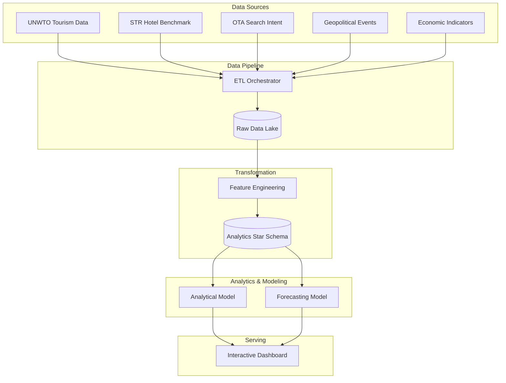
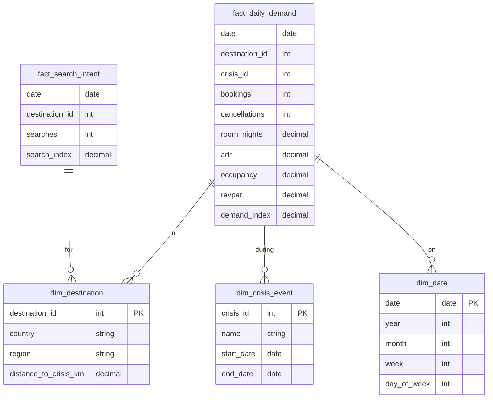
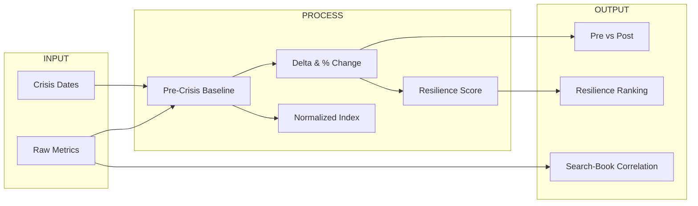
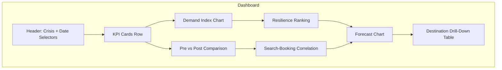

# System Architecture — Mermaid Diagrams

## Full System Flow

```mermaid
flowchart TB
    subgraph SOURCES["Data Sources"]
        UNWTO[UNWTO Tourism Data]
        STR[STR Hotel Benchmark]
        OTA[OTA Search Intent]
        GDELT[Geopolitical Events]
        ECON[Economic Indicators]
    end

    subgraph INGEST["Data Pipeline"]
        ETL[ETL Orchestrator]
        LAKE[(Raw Data Lake)]
    end

    subgraph TRANSFORM["Transformation"]
        FE[Feature Engineering]
        STAR[(Analytics Star Schema)]
    end

    subgraph MODELS["Analytics & Modeling"]
        ANALYTIC[Analytical Model]
        FORECAST[Forecasting Model]
    end

    subgraph SERVING["Serving"]
        DASH[Interactive Dashboard]
    end

    UNWTO --> ETL
    STR --> ETL
    OTA --> ETL
    GDELT --> ETL
    ECON --> ETL

    ETL --> LAKE
    LAKE --> FE
    FE --> STAR
    STAR --> ANALYTIC
    STAR --> FORECAST
    ANALYTIC --> DASH
    FORECAST --> DASH
```

## Data Model (Star Schema)

```mermaid
erDiagram
    fact_daily_demand ||--o{ dim_destination : "in"
    fact_daily_demand ||--o{ dim_crisis_event : "during"
    fact_search_intent ||--o{ dim_destination : "for"
    fact_daily_demand ||--o{ dim_date : "on"

    fact_daily_demand {
        date date
        destination_id int
        crisis_id int
        bookings int
        cancellations int
        room_nights decimal
        adr decimal
        occupancy decimal
        revpar decimal
        demand_index decimal
    }

    fact_search_intent {
        date date
        destination_id int
        searches int
        search_index decimal
    }

    dim_destination {
        destination_id int PK
        country string
        region string
        distance_to_crisis_km decimal
    }

    dim_crisis_event {
        crisis_id int PK
        name string
        start_date date
        end_date date
    }

    dim_date {
        date date PK
        year int
        month int
        week int
        day_of_week int
    }
```

## Crisis Impact Analysis Flow

```mermaid
flowchart LR
    subgraph INPUT
        RAW[Raw Metrics]
        CRISIS[Crisis Dates]
    end

    subgraph PROCESS
        BASELINE[Pre-Crisis Baseline]
        DELTA[Delta & % Change]
        INDEX[Normalized Index]
        RESILIENCE[Resilience Score]
    end

    subgraph OUTPUT
        COMPARE[Pre vs Post]
        RANK[Resilience Ranking]
        CORR[Search-Book Correlation]
    end

    RAW --> BASELINE
    CRISIS --> BASELINE
    BASELINE --> DELTA
    BASELINE --> INDEX
    DELTA --> RESILIENCE
    DELTA --> COMPARE
    RESILIENCE --> RANK
    RAW --> CORR
```

## Dashboard Component Hierarchy

```mermaid
flowchart TB
    subgraph DASH["Dashboard"]
        HEADER[Header: Crisis + Date Selectors]
        KPI[KPI Cards Row]
        CHART1[Demand Index Chart]
        CHART2[Pre vs Post Comparison]
        CHART3[Resilience Ranking]
        CHART4[Search-Booking Correlation]
        CHART5[Forecast Chart]
        TABLE[Destination Drill-Down Table]
    end

    HEADER --> KPI
    KPI --> CHART1
    KPI --> CHART2
    CHART1 --> CHART3
    CHART2 --> CHART4
    CHART3 --> CHART5
    CHART4 --> CHART5
    CHART5 --> TABLE
```
